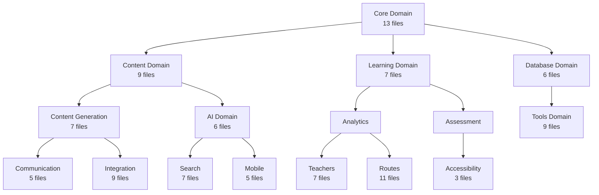

# LLM Analysis Documentation - By Domain

**Organization:** Hierarchical domain-based structure
**Total Files:** 116 documentation files
**Total Domains:** 16 functional areas

---

## Domain Overview

The documentation is organized into **16 functional domains** that mirror the codebase structure:

| Domain | Files | Focus | Description |
|--------|-------|-------|-------------|
| **Core** | 13 | Foundation | Base classes, models, standards |
| **Content** | 9 | Content Management | Content lifecycle, rendering, metadata |
| **Content Generation** | 7 | AI Content | AI-powered content creation |
| **Learning** | 7 | Learning Features | Analytics, assessment, progress |
| **AI** | 6 | Artificial Intelligence | AI features and research |
| **Communication** | 5 | Collaboration | Forums, messaging, collaboration |
| **Accessibility** | 3 | Inclusive Learning | WCAG compliance, accessibility |
| **Mobile** | 5 | Mobile & Offline | Mobile optimization, offline support |
| **Integration** | 9 | External Systems | LMS integration, distribution, export |
| **Teachers** | 7 | Instructor Tools | Course management, student management |
| **Search** | 7 | Discovery | Elasticsearch, visualization, websites |
| **Routes** | 11 | API Endpoints | FastAPI routes and dependencies |
| **Database** | 6 | Data Layer | MongoDB, PostgreSQL, base classes |
| **Tools** | 9 | Utilities | Validators, security, file handling |
| **Single** | 5 | Standalone | CLI, config, orchestration |
| **Other** | 2 | Special | Package overview, unknown files |

## Domain Map

## Navigation

### Browse by Domain

| Domain | Files | Description | Link |
|--------|-------|-------------|------|
| **Core** | 13 | Base classes & models | [📁 core](core/) |
| **Content** | 9 | Content management | [📁 content](content/) |
| **Content Generation** | 7 | AI content creation | [📁 content_generation](content_generation/) |
| **Learning** | 7 | Learning features | [📁 learning](learning/) |
| **AI** | 6 | AI features | [📁 ai](ai/) |
| **Communication** | 5 | Collaboration tools | [📁 communication](communication/) |
| **Accessibility** | 3 | Inclusive learning | [📁 accessibility](accessibility/) |
| **Mobile** | 5 | Mobile & offline | [📁 mobile](mobile/) |
| **Integration** | 9 | External systems | [📁 integration](integration/) |
| **Teachers** | 7 | Instructor tools | [📁 teachers](teachers/) |
| **Search** | 7 | Discovery features | [📁 search](search/) |
| **Routes** | 11 | API endpoints | [📁 routes](routes/) |
| **Database** | 6 | Data layer | [📁 db](db/) |
| **Tools** | 9 | Utilities | [📁 tools](tools/) |
| **Single** | 5 | Standalone modules | [📁 single](single/) |
| **Other** | 2 | Special files | [📁 other](other/) |

### Alternative Views

- **📁 By Type:** [modules/](by_type/modules/) | [files/](by_type/files/)
- **🔗 Cross References:** [dependency_graph.md](cross_references/dependency_graph.md)

### Root Access

- **📁 Main Directory:** [../](.)
- **📄 Package Overview:** [../00_package_overview.md](../00_package_overview.md)
- **📄 Combined File:** [../llm_analysis_complete.md](../llm_analysis_complete.md)

## Usage Tips

### Finding Information
1. **Start with domain** that matches your area of interest
2. **Use domain index** to see available documentation
3. **Follow cross-references** to related modules
4. **Search across all docs:** `grep -r "pattern" .`

### Domain-Specific Navigation
- **Core:** Start here for base classes and models
- **Content:** For content management and rendering
- **Learning:** For assessment and progress tracking
- **AI:** For AI-powered features
- **Integration:** For external system connections

---

**Generated:** October 1, 2025
**Structure:** Hierarchical by functional domain
**Total Domains:** 16 | **Total Files:** 116

