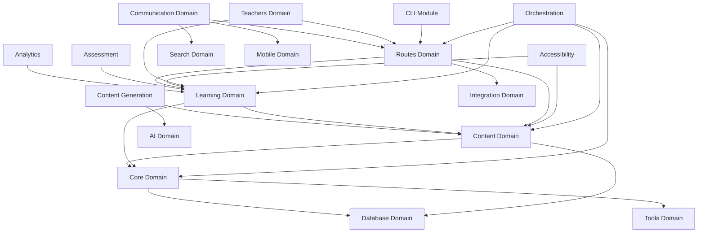
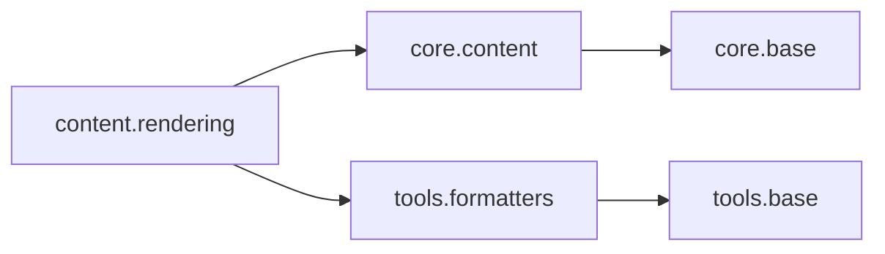
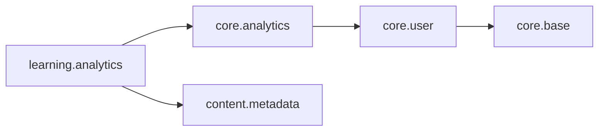
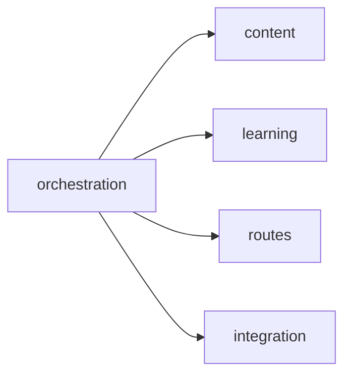

# Module Dependency Graph

**Generated:** October 1, 2025
**Visualization:** Module relationships and dependencies

---

## Overview

This dependency graph shows the relationships between different modules in the Curriculum Repository System. Arrows indicate import dependencies and usage relationships.

## Domain Dependencies



## Module Relationships by Domain

### Core Domain (Foundation)
- **Base Classes:** Used by all other domains
- **Models:** User, Content, Assessment, Analytics, Metadata
- **Dependencies:** Database layer, Tools

### Content Domain (Content Management)
- **Dependencies:** Core models, Database, Tools
- **Used By:** Learning, Routes, Accessibility, Orchestration
- **Key Files:** content.py, metadata.py, rendering.py

### Learning Domain (Learning Features)
- **Dependencies:** Core models, Content models, Database
- **Used By:** Routes, Teachers, Mobile, Accessibility
- **Key Files:** analytics.py, assessment.py, progress.py

### AI Domain (AI Features)
- **Dependencies:** Content models, Database, Tools
- **Used By:** Content Generation, Search, Learning
- **Key Files:** ai_features.py, research.py

### Integration Domain (External Systems)
- **Dependencies:** Content models, Learning models, Database
- **Used By:** Routes, Search, Mobile
- **Key Files:** integration.py, distribution.py, export.py

### Routes Domain (API Layer)
- **Dependencies:** All domain models and services
- **Used By:** External clients, CLI, Mobile
- **Key Files:** users.py, content.py, analytics.py, assessments.py

## Dependency Types

### Import Dependencies


### Usage Dependencies


### Service Dependencies


## Critical Paths

### Data Flow
```
External Request → Routes → Services → Models → Database
```

### Content Lifecycle
```
Creation → Generation → Quality Check → Metadata → Storage
```

### Learning Process
```
User → Assessment → Progress → Analytics → Recommendations
```

## Dependency Analysis

### High Coupling
- **Routes** depends on all domains (expected for API layer)
- **Orchestration** coordinates multiple domains
- **Core** provides base classes used everywhere

### Low Coupling
- **CLI** only depends on routes
- **Mobile** depends on limited domains
- **Accessibility** focused on specific enhancements

### Potential Refactoring Opportunities
1. **Circular Dependencies:** Check for any circular imports
2. **Heavy Dependencies:** Consider breaking down large modules
3. **Common Interfaces:** Extract common patterns into shared modules

## Navigation

- **📁 Back to Domain View:** [../by_domain/index.md](../by_domain/index.md)
- **📁 Root Documentation:** [../index.md](../index.md)
- **🔗 Module Details:** Browse individual domain folders

---

**Generated:** October 1, 2025
**Analysis:** Module dependency relationships
**Scope:** 69 modules across 16 domains

